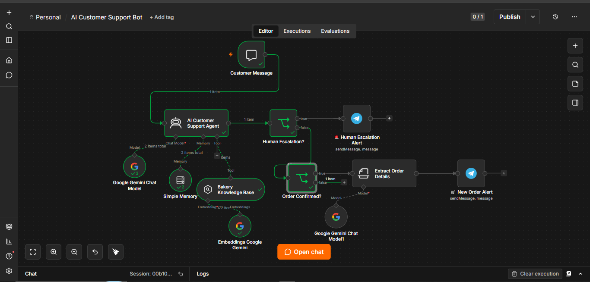
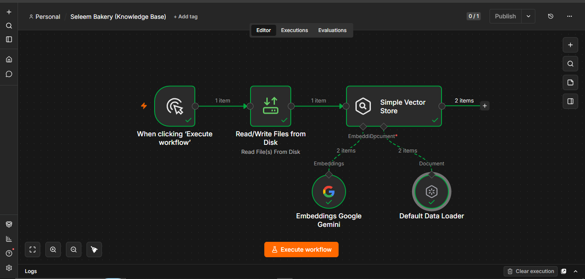
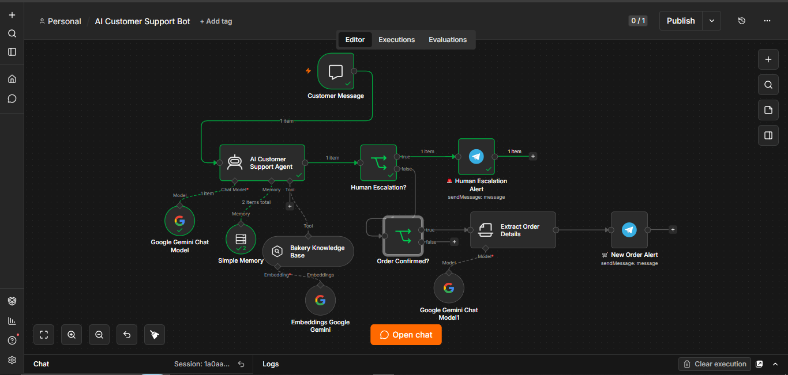
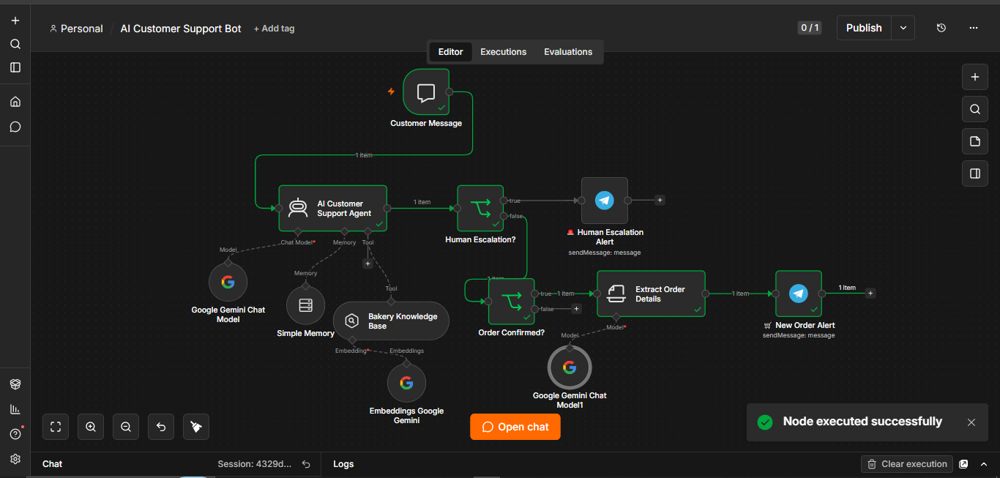
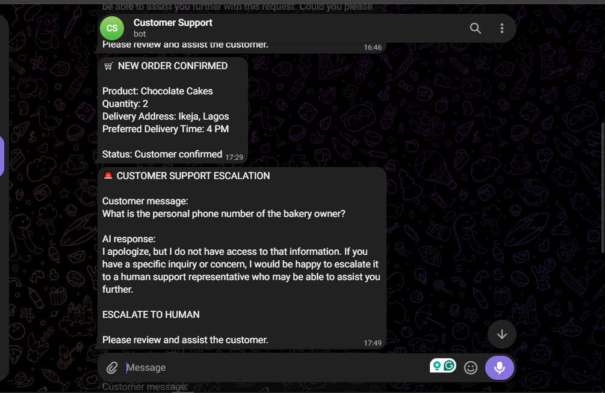

# AI Customer Support Bot

An AI-powered customer support and order management automation built with n8n.

This project demonstrates how an AI agent can use a company's knowledge base to answer customer questions, maintain conversation context, identify situations requiring human intervention, and notify the business when an order is confirmed.

## Project Overview

The system was built around Seleem Bakery as a practical example of an AI-powered customer support system.

The automation combines:

- n8n
- Google Gemini
- Retrieval-Augmented Generation (RAG)
- Vector Store
- Conversation Memory
- Conditional Logic
- Information Extraction
- Telegram Notifications

## 1. AI Customer Support Workflow

The customer starts a conversation through the n8n chat interface.

The AI Agent uses Google Gemini as its chat model, Simple Memory to maintain conversation context, and a Simple Vector Store to retrieve information from the company's knowledge base.

This allows the bot to answer customer questions using business-specific information rather than relying only on general AI knowledge.



## 2. Knowledge Base & RAG

The company's information is loaded into a vector store so the AI agent can retrieve relevant information when answering customer questions.

The knowledge base workflow uses:

**File → Data Loader → Text Splitting → Google Gemini Embeddings → Simple Vector Store**

This creates the RAG component of the customer support system, allowing the AI to retrieve information from the company's own knowledge base.



## 3. Human Escalation

Not every customer request should be handled by AI.

The workflow uses conditional logic to identify situations where human intervention is required.

When the escalation criteria are met, the request is routed to a Telegram notification so that a human support representative can take over.



## 4. Confirmed Order Automation

When a customer finalizes an order, the workflow detects the confirmation and sends the information to an Information Extractor.

The extractor structures the important order details, including:

- Product
- Quantity
- Delivery address
- Preferred delivery time

This makes the information easier for the business to process.



## 5. Telegram Business Notifications

The extracted order information is sent to the business through Telegram.

The notification system can also alert the business when a customer request requires human intervention.

This allows the business to receive important customer events without manually monitoring the chatbot.



## Workflow Architecture

```text
Customer Message
       │
       ▼
   AI Agent
   ├── Google Gemini
   ├── Simple Memory
   └── Simple Vector Store
            │
            ▼
       Decision Logic
       ┌────┴────┐
       │         │
       ▼         ▼
Human Escalation  Order Confirmed
       │              │
       ▼              ▼
   Telegram       Information
 Notification      Extractor
                       │
                       ▼
                   Telegram
                   Notification

Key Features
AI-powered customer support
Company-specific knowledge retrieval using RAG
Conversation memory
Human-in-the-loop escalation
Automated order information extraction
Telegram business notifications
Conditional workflow routing
Technologies Used
n8n — Workflow automation
Google Gemini — AI model and embeddings
RAG / Vector Store — Knowledge retrieval
Telegram — Business notifications
Docker — Local n8n environment
Workflow Files

The workflow folder contains the exported n8n workflow JSON files:

AI Customer Support Bot
Seleem Bakery Knowledge Base

The workflows can be imported into an n8n environment and configured with the required credentials.

What I Learned

This project helped me understand how AI automation can go beyond generating chatbot responses.

The workflow connects AI capabilities to:

Business-specific knowledge
Conversation memory
Decision-making logic
Structured data extraction
External notifications
Human intervention

The main takeaway is that effective AI automation is about connecting AI capabilities to real business processes and actions.

Future Improvements

Potential improvements include:

Connecting the customer-facing bot directly to Telegram
Connecting orders to Google Sheets or a database
Adding automated order status updates
Adding payment integration
Adding customer order history
Deploying the workflow to a production n8n environment

Built as part of my AI Automation learning journey with n8n.